<!-- Matteo Di Salvo · DisSa12 — profile README.
     The entire profile is ONE seamless dark SVG (assets/profile.svg), wrapped
     in a link to lumindis.com. No transparent gaps; icons are inlined. -->

